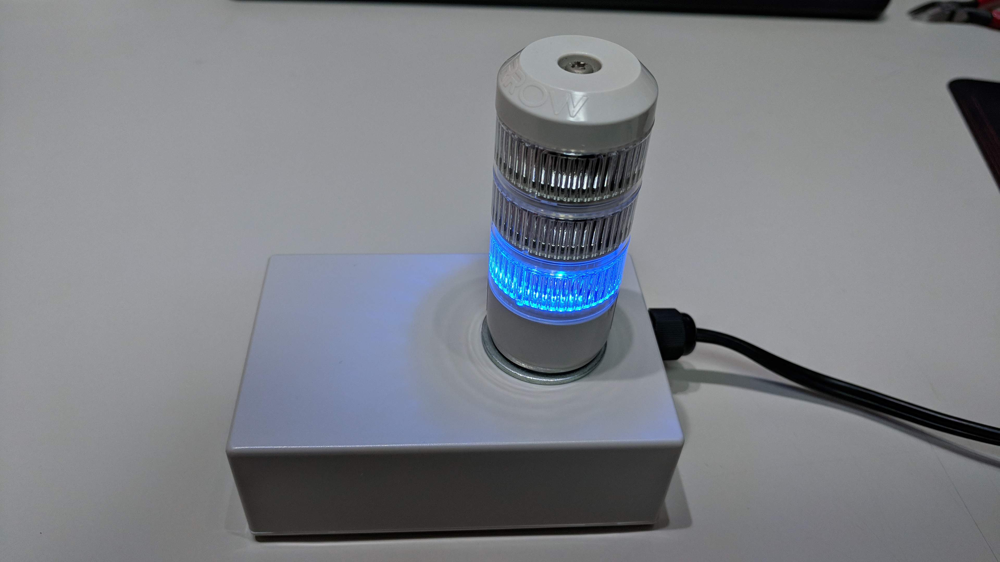
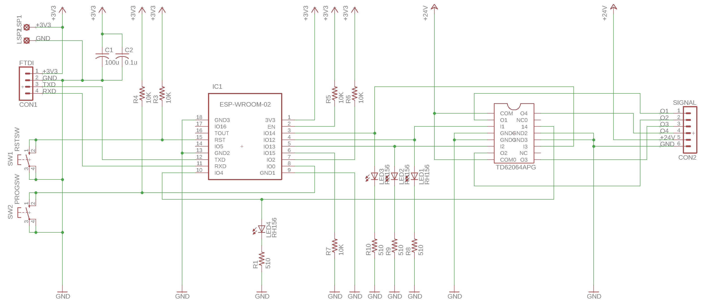
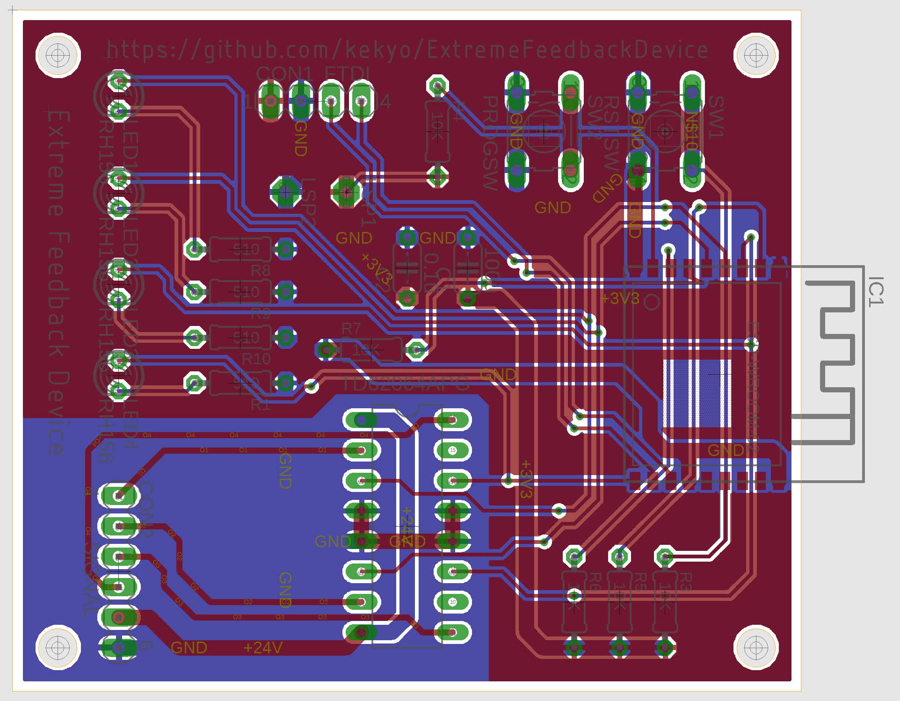
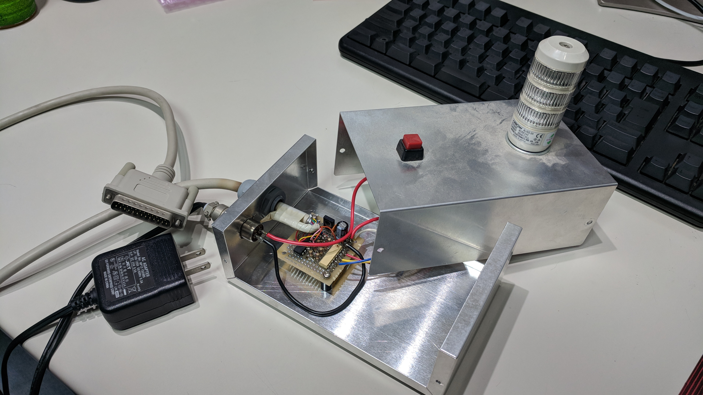

# Extreme feedback device (XFD) on ESP8266

* Still under construction...

## What's this?

* It's extreme feedback device (called XFD useful agile software development) running on ESP8266 (aka ESP-WROOM-02).
* I made custom schematic and artwork.
  * Use EAGLE 8
* I wrote sequencer code by C++ on ESP8266-Arduino IDE. (WIP)

## Features

* We can use signal device with 4 ports.
* For example, port 1, 2, 3 assign signal light's "Green", "Yellow" and "Red" leds. Port 4 assign buzzer.
* Signal device has to have one kind of commonly regulated voltage. I use +24V-0V based signal light.
  * Final output switcher is open-collectored transister using TOSHIBA "TD62064." https://toshiba.semicon-storage.com/info/docget.jsp?did=2229&prodName=TD62064BP1G
  * I use ARROW Electronics "AUSG-24" (In japanese): https://www.proface.co.jp/signaling/product/product_detail.php?unique_id=AUSG

## Schematic and artwork

* I'll order PCB to [Fusion PCB](https://www.seeedstudio.com/fusion_pcb.html).

## License

* Under Apache v2

## Background

* At first, I was exciting agile software development weaves. I made XFD device in 2006.
  * It was very standard formal style, using the signal light.
  * I did have no idea how to communicate easy way between PC/Server and devices. So I made with PC's printer parallel port.

* Today, we can communicate easier using a lot of procedures, USB/LAN/Wifi/Bluetooth and more. The parallel port obsoleted.
* I'm beginning to redesign for modern-style device communication. The ESP8266 totally better balanced module for IoT platform. I use ESP8266 and redesign XFD for basic boilerplate :)

## History

* first_pcb: Designed output signal with darlington transistor array. It's very simple board, contains only ESP-WROOM-02 and TrA.
